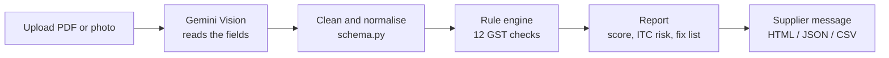

<div align="center">

# 🛡️ InvoiceKavach

### A spell-check for GST invoices. Catch mistakes before they cost you input tax credit.


**[🔗 Live demo](https://YOUR-APP.streamlit.app)** &nbsp;·&nbsp; **[🎬 Demo video](https://YOUR-VIDEO-LINK)** &nbsp;·&nbsp; Built solo for **Hack Devengers 2.0** (Open Innovation)

</div>

---

## In 30 seconds

Small Indian businesses make GST invoice mistakes all the time: the wrong tax type, a mistyped GSTIN, a missing HSN code, totals that do not add up. One error can block the buyer's **input tax credit (ITC)**, delay the payment and invite a notice.

**InvoiceKavach** reads any invoice (PDF or phone photo), checks it against GST rules, and gives you a **score, an ITC-risk verdict, a plain-language fix list, and a ready-to-send message for the supplier**.

> **The core idea: AI reads, code decides.** Gemini only *extracts* the fields. Every compliance verdict comes from deterministic Python rules, so results are repeatable, explainable and never hallucinated.

<div align="center">


</div>

---

## Table of contents

1. [The problem](#-the-problem)
2. [Our solution](#-our-solution)
3. [Screenshots](#-screenshots)
4. [What makes it different](#-what-makes-it-different)
5. [How it compares](#-how-it-compares)
6. [How it works](#-how-it-works)
7. [The 12 checks](#-the-12-checks)
8. [Project setup](#-project-setup)
9. [Deploy your own copy](#-deploy-your-own-copy)
10. [Project structure](#-project-structure)
11. [Limitations](#-limitations-honest)
12. [Roadmap](#-roadmap)

---

## 🎯 The problem

India's micro and small businesses issue GST invoices every day, often from Excel, Word, handwritten bills or older billing software. They rarely have an accountant checking each one.

**A real example.** A supplier in Nagpur (Maharashtra) sells to a buyer in Hyderabad (Telangana). That is an *inter-state* sale, so **IGST** must be charged. The supplier charges **CGST + SGST** instead. The buyer cannot claim the credit correctly, the supplier has to issue a corrected invoice or credit note, and the payment is stuck.

The same chain repeats for many small mistakes:

```
Wrong invoice  →  ITC mismatch  →  Payment delay  →  Notice / penalty
```

Common causes:

| Mistake | Why it hurts |
|---|---|
| CGST+SGST charged on an inter-state sale (or the reverse) | Wrong credit, needs correction |
| Mistyped GSTIN | Invoice does not match in the buyer's GSTR-2B |
| Missing or short HSN/SAC | Non-compliant invoice |
| Old GST rate after the 22 Sep 2025 rate change | Under- or over-charged tax |
| Totals that do not add up | Disputes and delays |
| An *estimate* or *proforma* treated as a tax invoice | ITC cannot be claimed on it |

**Who feels this:** small sellers who want to send correct invoices, and small buyers and bookkeepers who want to be sure before claiming ITC.

---

## 💡 Our solution

InvoiceKavach is a **pre-flight check** for GST invoices. It does not create invoices. It checks the ones you already have, whoever made them.

1. **Upload** a PDF or photo (PDF, PNG, JPG, WEBP).
2. **AI reads it.** Google Gemini extracts seller, buyer, GSTINs, invoice number, date, HSN/SAC, taxable value, CGST/SGST/IGST and total.
3. **Rules check it.** A Python rule engine runs 12 GST checks on the extracted data.
4. **You get an actionable report:** score out of 100, **ITC risk (Low / Medium / High)**, a "how to fix" list, a message you can send to the supplier on WhatsApp, and downloads as HTML (print to PDF), JSON and CSV.

If the AI misreads something (blurry photo, handwriting), you can **edit the values and re-run the checks** in one click.

---

## 📸 Screenshots

| Report with a verdict stamp | Fix list with plain-language advice |
|---|---|
|  |  |

---

## ✨ What makes it different

**1. It separates reading from judging.**
Most "AI invoice" tools stop at extraction, or ask a chatbot for an opinion. We use AI only for what it is good at (reading messy documents) and hand the verdict to deterministic code. The same invoice gives the same result every time, and every flag can be explained in one sentence.

**2. Real GSTIN validation, not just a pattern.**
We implement the public mod-36 check-digit algorithm, so a single mistyped or misread character is caught. A plain pattern check would miss it. Validated against publicly documented GSTINs in the test suite.

**3. Date-aware GST rates.**
The valid rate slabs depend on the invoice date. From **22 Sep 2025** the 12% and 28% slabs were removed. InvoiceKavach checks the rate against the slabs in force *on the invoice date*, so an old-rate invoice is flagged and an older invoice is not wrongly accused.

**4. It understands the state logic.**
It compares the seller's state (from the GSTIN) with the place of supply to decide whether CGST+SGST or IGST is correct, and verifies CGST equals SGST.

**5. It catches documents that are not tax invoices at all.**
Estimates, quotations, proforma invoices and foreign-currency invoices are recognised and flagged instead of being checked as if they were valid tax invoices.

**6. It closes the loop with action, not just alerts.**
A prioritised fix list, a copy-paste **message to the supplier**, and a printable report. Both sellers (before sending) and buyers (before claiming ITC) can use it.

**7. Zero friction.**
No login, no database, nothing stored. Three built-in sample invoices work without any API key.

---

## ⚖️ How it compares

| | **InvoiceKavach** | Invoicing / accounting software | Generic invoice OCR / AI extractors | Pasting into a general AI chatbot |
|---|:---:|:---:|:---:|:---:|
| Checks an invoice made **anywhere** (Excel, Word, scan, supplier's PDF) | ✅ | ❌ mostly only invoices made inside the tool | ✅ | ✅ |
| India-specific GST logic (state vs place of supply, slabs, Rule 46 format) | ✅ | ✅ when generating | ❌ usually extraction only | ⚠️ depends on prompt and model |
| Same invoice gives the **same verdict** every time | ✅ deterministic rules | ✅ | n/a | ❌ can vary between runs |
| GSTIN **check-digit** validation | ✅ | ⚠️ varies | ❌ | ⚠️ often unreliable |
| Knows the **22 Sep 2025** rate change, by invoice date | ✅ | ✅ vendor keeps it updated | ❌ | ⚠️ depends on the model's knowledge |
| Flags estimates, proforma and foreign-currency documents | ✅ | ➖ not applicable | ❌ | ⚠️ only if asked |
| Tells you **what to fix** and drafts a **message to the supplier** | ✅ | ❌ | ❌ | ⚠️ only if asked |
| Free, no login | ✅ | ⚠️ usually accounts or paid plans | ⚠️ often paid APIs | ✅ |
| Verifies the GSTIN is **registered and active** on the GST portal | ❌ *(roadmap)* | ⚠️ some do | ❌ | ❌ |

<sub>A general comparison of tool categories, not of specific products. Individual products differ. We are strongest where the row says "checks any invoice" and "same verdict every time". We are honest about where we are not (last row).</sub>

**Why not just ask a chatbot?** You can, and for one invoice it may even work. But the answer is free text that can change between runs, the check digit is arithmetic that language models often get wrong, and nothing is structured, scored or exportable. InvoiceKavach uses the AI for reading and code for judging.

---

## 🔧 How it works



| Layer | Role | Who does it |
|---|---|---|
| Extraction | Read messy documents | **AI** (Gemini) |
| Normalisation | Clean `₹1,18,000`, `14/08/2026`, `27aakps...` | Code |
| Validation | Decide compliance | **Code** (deterministic) |
| Reporting | Score, risk, fixes, exports | Code |

The score is a weighted average over the checks that apply (pass = full, warning = half, fail = zero). Risk is **High** if any check fails, **Medium** if there are only warnings, **Low** otherwise.

The app has model fallback (`gemini-3.1-flash-lite` → `gemini-3.5-flash` → `gemini-2.5-flash`), caches results per file so repeat uploads do not use quota, and shows which model read each invoice.

---

## ✅ The 12 checks

| # | Check | What it verifies |
|---|---|---|
| 1 | Mandatory fields | Seller name and GSTIN, invoice number, date, place of supply, taxable value, total |
| 2 | Document type | Tax invoice vs estimate / quotation / proforma / bill of supply |
| 3 | Currency | Amounts in INR (GST amount checks are skipped for foreign currency) |
| 4 | Seller GSTIN | 15 characters, pattern, valid state code, **mod-36 check digit** |
| 5 | Buyer GSTIN | Same tests; a missing GSTIN is a warning (fine for B2C) |
| 6 | Invoice number | At most 16 characters; only letters, digits, `-` and `/` (Rule 46) |
| 7 | Invoice date | Valid, not in the future, not before GST began |
| 8 | HSN / SAC | Present, with 4, 6 or 8 digits |
| 9 | Tax type | Same state → CGST+SGST; different state → IGST |
| 10 | CGST = SGST | Equal amounts on same-state sales |
| 11 | GST rate | Implied rate matches a valid slab **for the invoice date** |
| 12 | Total | Taxable value + taxes + cess + round-off = total (₹1 tolerance) |

---

## 🚀 Project setup

### What you need

- **Python 3.10 or newer** ([python.org](https://www.python.org/downloads/))
- **Git** ([git-scm.com](https://git-scm.com/downloads))
- A free **Gemini API key** from [Google AI Studio](https://aistudio.google.com/app/apikey) *(only needed to analyse your own uploads; the 3 built-in samples work without it)*

### 1. Get the code

```bash
git clone https://github.com/YOUR-USERNAME/invoicekavach.git
cd invoicekavach
```

### 2. Create a virtual environment and install

<details open>
<summary><b>Windows (Git Bash)</b></summary>

```bash
python -m venv venv
source venv/Scripts/activate
pip install -r requirements.txt
```
</details>

<details>
<summary><b>Windows (Command Prompt / PowerShell)</b></summary>

```bat
python -m venv venv
venv\Scripts\activate
pip install -r requirements.txt
```
</details>

<details>
<summary><b>macOS / Linux</b></summary>

```bash
python3 -m venv venv
source venv/bin/activate
pip install -r requirements.txt
```
</details>

You should see `(venv)` at the start of your terminal line once it is active.

### 3. Add your API key

```bash
cp .streamlit/secrets.toml.example .streamlit/secrets.toml
```

Open `.streamlit/secrets.toml` and replace the placeholder:

```toml
GEMINI_API_KEY = "your-key-here"
```

> `secrets.toml` is git-ignored, so your key is never committed. Prefer not to create a file? You can also paste the key into the app's sidebar for the current session.

**Optional:** choose the model(s) yourself, tried in order:

```toml
GEMINI_MODEL = "gemini-3.1-flash-lite, gemini-3.5-flash"
```

Not sure which models your key can use? Run `python check_key.py YOUR_KEY`.

### 4. Run

```bash
streamlit run app.py
```

Open **http://localhost:8501**. Start with the three sample buttons, then upload the files in [`sample_invoices/`](sample_invoices/) or your own.

### 5. Run the tests

```bash
python tests/test_validators.py
```

### Troubleshooting

| Problem | Fix |
|---|---|
| `venv\Scripts\activate: command not found` in Git Bash | Use forward slashes: `source venv/Scripts/activate` |
| "API key was rejected" | Re-copy the key from AI Studio (no spaces or quotes), then run `python check_key.py YOUR_KEY` |
| "Model not available" | Set `GEMINI_MODEL` to a name printed by `check_key.py` |
| "Today's free AI quota is used up" | Free-tier limits are per project and reset daily. Use a sample invoice or try later |
| Sidebar keeps asking for the key | Create `.streamlit/secrets.toml` in the same folder as `app.py`, then restart |
| PDF preview is missing | Optional. Make sure `pymupdf` installed (`pip install -r requirements.txt`) |

---

## ☁️ Deploy your own copy

1. Push this repository to your GitHub account (public).
2. Go to [share.streamlit.io](https://share.streamlit.io), sign in with GitHub and choose **Create app**.
3. Select the repository, branch `main`, and main file `app.py`.
4. Open **Advanced settings → Secrets** and add:
   ```toml
   GEMINI_API_KEY = "your-key-here"
   ```
5. Click **Deploy**. Every future `git push` redeploys automatically.

---

## 🗂️ Project structure

```
invoicekavach/
├── app.py              Streamlit screens and navigation
├── extractor.py        Gemini call, model fallback, error handling
├── schema.py           Field definitions and data cleaning
├── validators.py       The GST rule engine (no AI)
├── report.py           Score, ITC risk, supplier message, exports
├── ui.py               Design system: CSS and HTML components
├── demo_data.py        3 dummy sample invoices (no API key needed)
├── check_key.py        Helper: lists the Gemini models your key can use
├── tests/              19 unit tests for the rule engine
├── sample_invoices/    Dummy invoices to try
├── docs/               PRD, app flow, implementation plan, screenshots
└── .streamlit/         Theme and secrets template
```

**Tech stack:** Python · Streamlit · Google Gemini (`google-genai`) · PyMuPDF (PDF preview)

---

## ⚠️ Limitations (honest)

- We check **how an invoice is written**. We do not verify that the supplier exists, has filed returns or has paid tax. There is no GST portal integration, so GSTR-2B matching and "is this GSTIN active" are out of scope for now.
- The GSTIN check digit proves a number is *well-formed*, not that it is *registered*.
- AI can misread blurry or handwritten invoices. That is why extracted values can be edited and re-checked.
- An invoice with several items at different GST rates may trigger a rate warning, because the blended rate matches no single slab.
- Special cases (exports, SEZ, reverse charge, composition dealers, cess) are only partly handled.
- The invoice is sent to Google's Gemini API to be read. The app itself stores nothing. Do not use sensitive real invoices for demos.
- This is a helper tool, **not legal or tax advice**. Verify important invoices with a qualified professional.

---

## 🛣️ Roadmap

- [ ] Hindi and English interface
- [ ] Live GSTIN verification against the GST portal
- [ ] GSTR-2B matching for buyers
- [ ] Multi-item, multi-rate invoices
- [ ] Batch upload
- [ ] e-invoice IRN / QR validation
- [ ] HSN-to-rate lookup

---

## 👤 Author

Built by **[Your Name]** for **Hack Devengers 2.0** (Open Innovation track).
[GitHub](https://github.com/YOUR-USERNAME) · [LinkedIn](https://linkedin.com/in/YOUR-PROFILE)

Licensed under the [MIT License](LICENSE).
